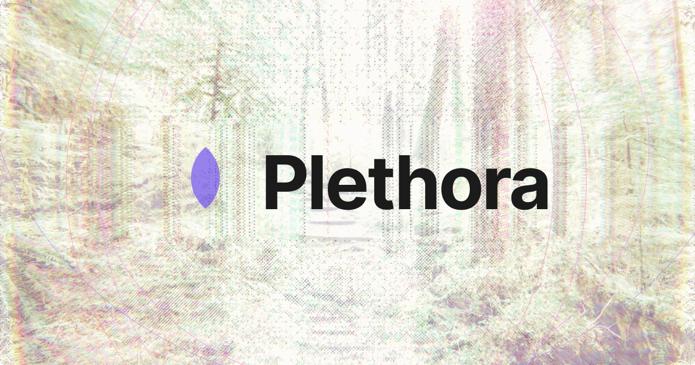
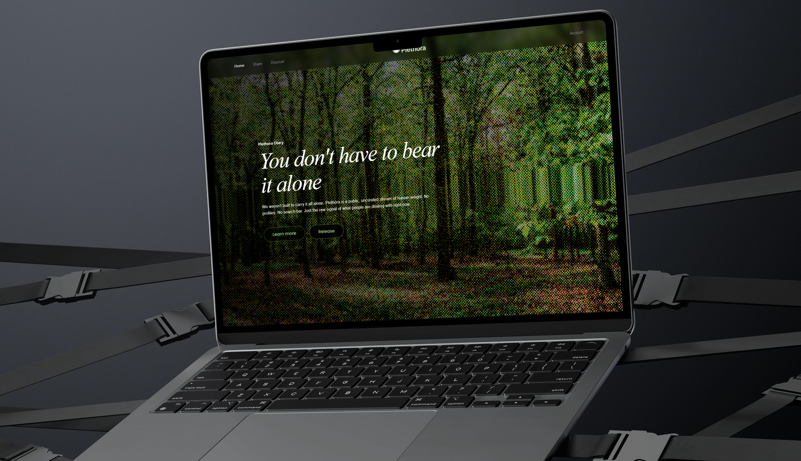
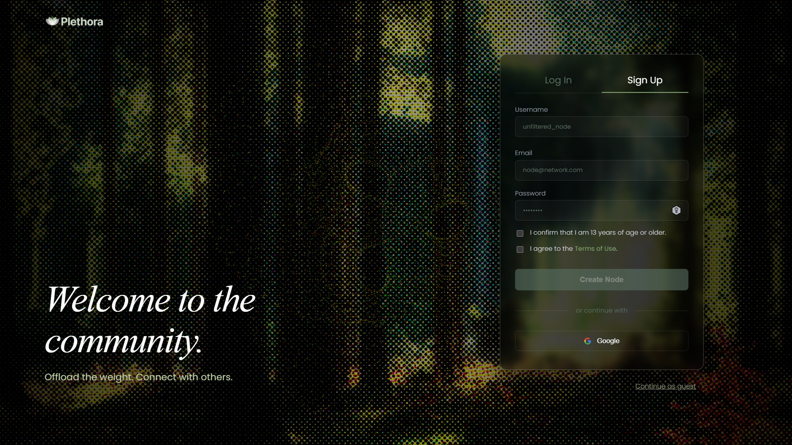
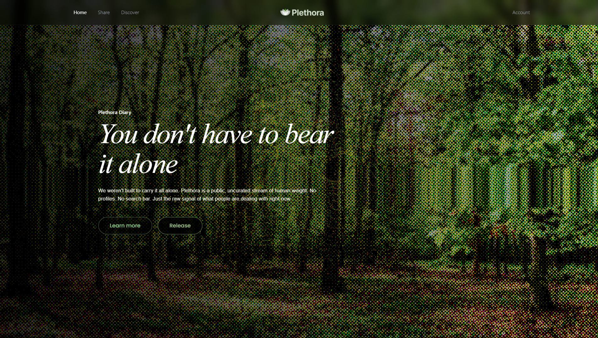
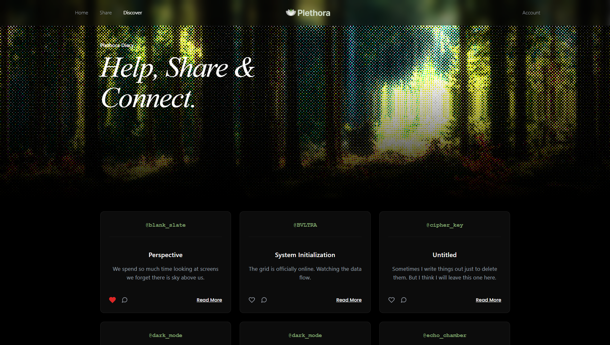
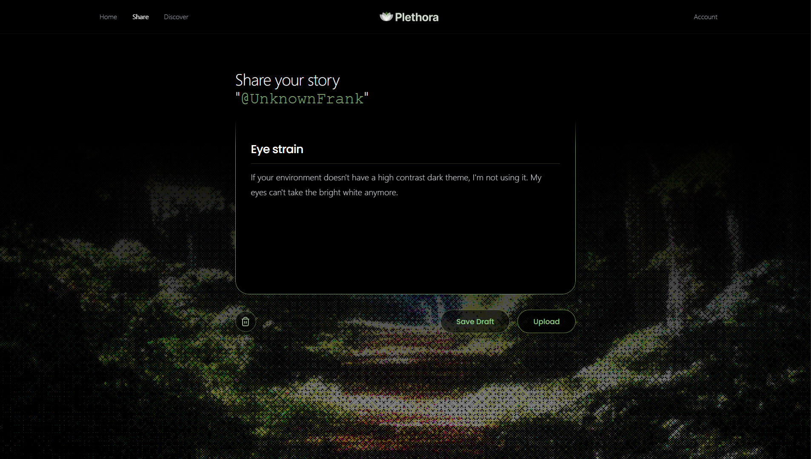
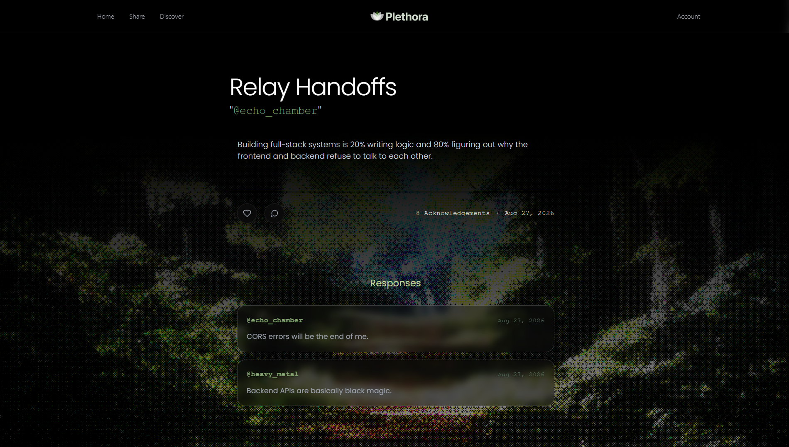
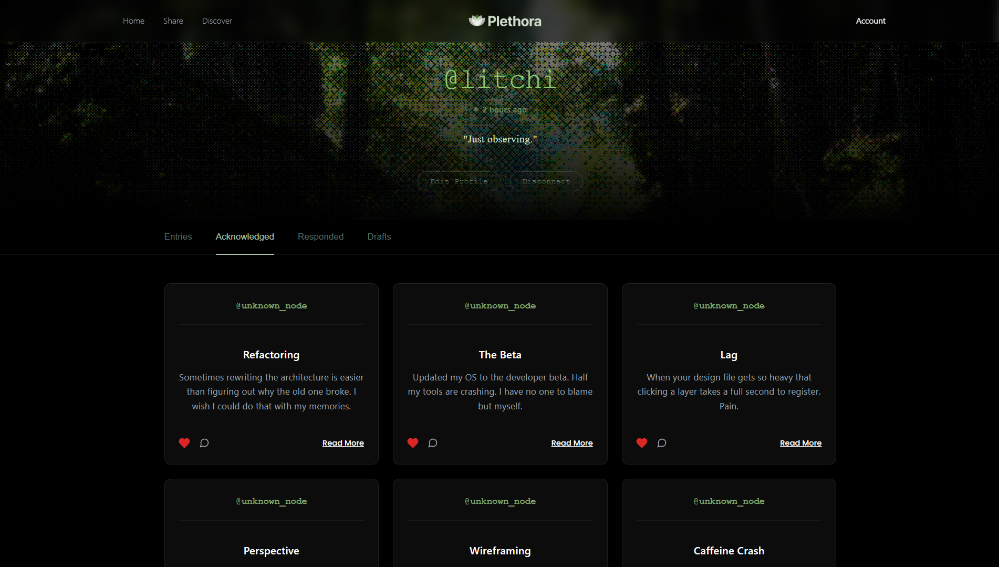

# Plethora // Public Diary



**Current Build:** v1.0.0 (August 2026)

**State:** Production Ready

## Description

Plethora is a digital release valve designed for the public, anonymous offloading of personal burdens—whether emotional, relational, or existential. It's built on the premise that while the things we carry feel deeply isolating, the act of releasing them doesn't have to be.

Rather than siloing user data or encouraging curated highlight reels, Plethora forces users into a shared, uncurated stream of human experience. The visual language reflects this tension: a glitched, tech nature aesthetic layered over minimalist brutalism. It’s raw, stark, and unpolished by design, stripping away the noise of typical social platforms to leave only the unvarnished signal.

---

## Premise & Structural Constraints

This architecture was shaped by three specific constraints that dictate both the system's structure and the user's psychology:

*   **Human Truth: "No one should do this alone"**
    This is the foundation of the platform. Plethora exists because carrying things in isolation is inherently heavy. The app provides a space to externalize internal weight.
*   **Behavioral Twist: "Every action is publicly visible"**
    Total anonymity meets total exposure. When an issue is uploaded, it isn't locked away; it is thrust out into the open. You are completely unnamed, but you are entirely perceived. This creates a strange, shared vulnerability—everyone is speaking into the void, but the void is watching back.
*   **Build Constraint: "There is no search bar"**
    This is the most critical structural mechanism of the app. By removing the ability to search, we remove the user's ability to curate, filter, or hunt for specific content. You cannot seek out people who share your exact problem. Instead, you are confronted with a collective, uncurated stream of human experience exactly as it arrives. It forces serendipity, demands presence, and prevents the platform from becoming a tool for confirmation bias.

---

## Table of Contents

- [Description](#description)
- [Premise & Structural Constraints](#premise--structural-constraints)
- [Demonstrations & Documentation](#demonstrations--documentation)
- [How It Works](#how-it-works)
- [Tech Stack](#tech-stack)
- [Setup & Installation](#setup--installation)
- [Data Model](#data-model)
- [Project Structure](#project-structure)

---

## Demonstrations & Documentation

*   **Demonstration Video:** [https://drive.google.com/drive/folders/1uAG9z5n2Ix_RZ91k1ivxy8J14gO0Dxh6?usp=sharing]
*   **ER Diagram:** Included in root folder as `ER_Diagram.png`
*   **SQL Export:** Included in root folder as `plethora.sql`

### System Mockup


### System Screenshots

**1. Signup**

*The the beginning to an environment of openness*

**2. Home**

*The digital sanctuary. Features the interactive WebGL canvas and the architectural manifesto explaining the system's core constraints.*

**3. Discover**

*The uncurated, chronological stream of human experience. No search bar, no algorithms. Just the raw signal.*

**4. Editor**

*The isolated writing environment. High-contrast and minimal, allowing the author to focus entirely on externalizing their thoughts before saving a draft or publishing.*

**5. Read & Respond**

*A singular entry expanded. Displays the author's formatted text alongside chronological responses from the community and interaction metrics.*

**6. Account Dashboard**

*The user's private command center. Manages published entries, private drafts, interaction history, and the permanent system disconnect (purge) controls.*

---

## How It Works

Plethora operates on a decoupled client-server architecture, prioritizing raw CSS mechanics and optimized relational databases over bloated JavaScript libraries.

*   **Unified Auth Flow:** A single-card interface morphs dynamically between Login and Signup modes without page reloads. This is achieved mathematically by placing conditional inputs inside a CSS Grid and animating `grid-template-rows` from `0fr` to `1fr`.
*   **Session Broadcasting:** A global React Context (`AuthContext`) tracks the browser's `localStorage` to keep the application state fully self-aware. If a session is active, the DOM automatically re-renders global elements (like shifting the Navbar from "Sign In" to "Account").
*   **Database Normalization:** To prevent data anomalies, Usernames are strictly stored in the `users` table. Entries and comments tie back via `user_id`. Furthermore, drafts and published posts share the same database tables, utilizing a `status ENUM` to eliminate schema drift.
*   **Cascading Deletes:** Foreign keys utilize `ON DELETE CASCADE`. If a node (user) is deleted, the database automatically burns down their entire data tree (entries, comments, likes) at the root level.

---

## Tech Stack

| **Frontend** | **Purpose** | **Backend** | **Purpose** |
| :--- | :--- | :--- | :--- |
| **React (Vite)** | UI framework & component library | **PHP 8+** | REST API & Core Engine Logic |
| **React Router** | SPA Navigation & Route Protection | **MySQL** | Relational Database |
| **React Context** | Global state management (Auth) | **PDO** | Secure Database Connections |
| **Vanilla CSS** | Glassmorphism & Grid animations | **XAMPP / Apache** | Local Server Environment |

---

## Setup & Installation

To spin up the machine locally, you must boot the Database, the PHP Engine, and the React Grid in sequence.

### Prerequisites
*   Node.js (v18 or higher) for the frontend
*   XAMPP (or similar Apache/MySQL stack) for the backend

### 1. Ignite the Vault (Database)
1. Start Apache and MySQL via the XAMPP Control Panel.
2. Open your database manager (like phpMyAdmin) and create a new database named exactly: `plethora`.
3. Import the provided `plethora.sql` file to establish the schema and seed the dummy data.

### 2. Ignite the Engine (Backend)
1. Navigate to your XAMPP `htdocs` folder.
2. Create a folder named `plethora_api`.
3. Copy all `.php` files from the repository's backend directory into `htdocs/plethora_api`.

### 3. Ignite the Grid (Frontend)
```bash
# Navigate to the frontend directory
cd frontend

# Install core dependencies
npm install

# Install WebGL animation dependencies (Three.js ecosystem)
npm install three @react-three/fiber @react-three/drei

# Boot the Vite development server
npm run dev

```

---

## Data Model

The relational blueprint is designed for structural efficiency and cascading integrity.

### Users Schema

```sql
id INT AUTO_INCREMENT PRIMARY KEY
username VARCHAR(50) UNIQUE NOT NULL
email VARCHAR(255) UNIQUE NOT NULL
password_hash VARCHAR(255) NULL
role VARCHAR(20) DEFAULT 'user'
created_at TIMESTAMP

```

### Entries Schema

*(Handles both published posts and private drafts via the `status` enum)*

```sql
id INT AUTO_INCREMENT PRIMARY KEY
user_id INT NOT NULL (FOREIGN KEY ON DELETE CASCADE)
title VARCHAR(255)
content TEXT
status ENUM('draft', 'published') DEFAULT 'draft'
created_at TIMESTAMP

```

### Comments Schema

```sql
id INT AUTO_INCREMENT PRIMARY KEY
user_id INT NOT NULL (FOREIGN KEY ON DELETE CASCADE)
entry_id INT NOT NULL (FOREIGN KEY ON DELETE CASCADE)
content TEXT
status ENUM('draft', 'published') DEFAULT 'draft'
created_at TIMESTAMP

```

### Likes Schema

*(Junction table preventing duplicate actions via a composite primary key)*

```sql
user_id INT NOT NULL (FOREIGN KEY ON DELETE CASCADE)
entry_id INT NOT NULL (FOREIGN KEY ON DELETE CASCADE)
PRIMARY KEY (user_id, entry_id)

```

---

## Project Structure

```text
plethora/
├── frontend/                     # React (Vite) client
│   ├── public/                   # Static assets (images, fonts, SVGs)
│   ├── src/
│   │   ├── assets/               # Local images & backgrounds
│   │   ├── components/           # Reusable UI (Navbar, Footer, Modals)
│   │   ├── context/              # Global state (AuthContext)
│   │   ├── pages/                # Route views (Home, Discover, Share, Account)
│   │   ├── App.jsx               # Main router
│   │   └── main.jsx              # React DOM entry point
│   └── package.json
│
├── plethora_api/                  # PHP REST API 
│   ├── db.php                    # PDO Connection & CORS setup
│   ├── account.php               # Data aggregation endpoint
│   ├── story.php                 # Read & Draft verification endpoint
│   ├── create_entry.php          # Insert endpoint
│   ├── update_entry.php          # Draft modification endpoint
│   ├── delete_entry.php          # Admin/Author deletion endpoint
|   ├── ER_Diagram.png            # Visual data relationships
│   └── seed.php                  # Database wipe & dummy data generator  ...and more .php files
│
├── backend/                      # Folder with all the endpoint to connect to a server without php
└── README.md                     # This file

```

---

## License & Usage

**Source-Available / Personal Use Only**

This project is NOT open-source. You are welcome to clone the repository, inspect the code, and run it locally on your own machine for personal study, examination and experimentation.

However, you may **not**:

* Host or deploy this application publicly.
* Monetize or use it for commercial purposes.
* Unless permitted, present it as part of an educational curriculum, bootcamp, or workshop.
* Reskin the UI and claim it as your own work.

See the [LICENSE](https://www.google.com/search?q=LICENSE) file for the full legal terms.
Copyright (c) 2026 [BVLTRA](https://www.google.com/search?q=https://github.com/BVLTRA). All rights reserved.
